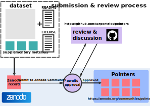

# Submission Guide

## Submission & Review Process
Datasets submitted to the Pointers community will be reviewed and accepted based on their:

- organisation
- documentation
- license
- supplementary materials & information

All datasets submitted to the library will be reviewed by at least one person.

### Information for Submitters
There are two parts to a submission:

1. A request should be made to add a [Zenodo][zenodo] record for the dataset to [the Pointers community][pointers-zenodo].
2. A new issue should be opened on this repository, where the submission can be reviewed and discussed before inclusion.

Before preparing a dataset for submission,
please read the information below.
You may also find it helpful to refer to
[the checklist reviewers will use to assess the suitability of a record for inclusion in the Pointers collection][review-checklist].

### Inclusion Requirements and Guidance
Datasets in this collection should be "ready to use" for appropiate lessons/curricula.
To ensure that datasets are as easy as possible for educators to reuse and adapt
to their own lessons,
we ask that submissions include a range of supporting information alongside
the data itself.
Below are guidelines for datasets to be included in the collection.

##### Data Organisation
Tabular data should be _tidy_,
as [described by Hadley Wickham in 2014][wickham-tidy-data-2014].
A full explanation of this concept can be found in the linked paper,
but the key points are:

- each variable should be represented as a column in the data table
- each observation should be represented as a row in the data table
- each table should account for a single type of observational unit

Data should also be **human readable**.
For example, it should use column names that are easy for a human to interpret or,
if this is not possible, column names should be well described in the accompanying documentation.

We **prefer plain text formats** for data.
The dataset should not require access to specific tools for reading or formatting the data.
Even common tools (e.g. Microsoft Excel, Google Sheets) can introduce formatting and other errors to the dataset.
Plain text (e.g. .csv) datasets are preferred when the data is in the generic tabular format,
though database formats (e.g. `sqlite`) can also be provided if appropriate.

**Smaller datasets are preferred**.
In many cases, it is appropriate to provide a reduced version of a complete dataset to the Pointers collection.
Consider creating a useful subset of your dataset
in order to reduce any problems users might have using large or complicated data in an educational setting.
Zenodo limits the maximum size of uploads to 50GB.

##### Data Documentation
Documentation can be quite minimal for datasets in the collection.
At the very least, each dataset should be accompanied by a README -
a plain text file in the root directory of the data record.
The README file should contain at least the following information:

- **Dataset Overview and Provenance**:
  A brief (1-3 sentence) description of the dataset
  and the reason and context in which it was originally collected/produced.
- **Use Cases**: A brief description of the teaching/workshop use cases you have identified for the dataset.
  What type(s) of lessons have you used this dataset for?
  (e.g. data visualization, data cleaning, time series analysis, etc.)
- **Keywords**: High level terms that describe the dataset and/or it’s use cases.
  At a minimum, include one keyword that describes the research domain for the dataset
  (e.g. economics, oceanography, genetics).
- **File/Variable Descriptions**:
  If the dataset is comprised of multiple files,
  briefly describe each file and the data it contains.
  For each variable,
  briefly describe the variable and what units of measure are used,
  if any (e.g. day of year, height in centimeters).
- **Codes**: For any variables that have been encoded,
  include a key to the codes to help users understand the data in detail.
- **Hazards**: Briefly describe anything about the dataset that makes it difficult to use,
  or any common pitfalls that someone might encounter trying to use the dataset e.g.
  missing values, or values that may be interpreted as missing by data analysis tools.
  Ideally, provide suggestions about how a user might avoid these hazards.
- **Processing**: If the data has been processed in any way,
  describe this processing,
  any meaningful information that may have been removed through processing,
  and the implications for use
  (e.g. _"the rainfall variable represents the hourly average rainfall amount based on rainfall measurements collected every minute - variance around this average is not reported"_).
  If this is a "teaching version" of a larger dataset,
  cite and link to the full version of the dataset.
- **Citation**: Each dataset should have a proper data citation -
  Zenodo will automatically generate a DOI for the record,
  which can be used in citation information included in the README file.
  In addition, if the data does not originate from the dataset submitter,
  provide proper citation for the source dataset.

##### License(s)
To eliminate barriers to reuse,
datasets in the collection should be released into the **public domain**,
i.e. published with [the Creative Commons Zero waiver (CC0)][cc0].
We will also accept datasets published with
[the Creative Commons Attribution 4.0 International license (CC-BY)][cc-by],
but we encourage submitters to consider that
[CC-BY is not considered appropriate for licensing data][panton]
and the license may have the unintended effect of making it more difficult for
others to reuse the data.

Our recommendation is to include multiple license files in the dataset record,
inside a `LICENSES` folder:

- a `data.txt` file containing a [CC0 waiver][cc0] waiver for the data itself
- a `documentation.txt` file containing a [CC-BY][cc-by] license for the accompanying documentation
- and, if any software has been included in the record
  (see _Supplementary Materials & Information_ below),
  a `code.txt` file containing an [MIT license][mit] for that software

##### Supplementary Materials and Information
In addition to the dataset and README file,
submitters may wish to provide additional supplementary information for the dataset,
including such materials as: [data dictionaries][data-dict],
related publications, code, or related teaching materials.

**Teaching Materials**:
If you or others have taught with the dataset and have lesson plans,
syllabi, or other pedagogical materials you wish to share,
please ensure that they are presented in a generalized way that would allow
people unfamiliar with the data and/or material to understand and teach it
with relatively little preparation time.
Teaching materials should be presented in as open a format as possible
e.g. plain text or pdf rather than `.pptx` or `.docx` files.

**Code**:
We recommend sharing any code used to produce, process, or teach the dataset.
Such code should have sufficient internal documentation
(at minimum, comments within the code itself)
to allow a potential user to understand and run the code independently.
Internal documentation/comments should also describe the context in which the code
has been used and (where applicable) how it is related to teaching with the dataset.
We prefer source code written in an open source language such as R or Python,
code from other platforms if there is sufficient reason for its inclusion.
Large and complex software related to the dataset may be better kept in a separate,
public repository (e.g. on GitHub or a similar hosting platform) and linked to
from the dataset record.
Submitters are encouraged to use their own judgement when deciding whether to include
software with the data.
Any code included in the dataset record should be published with [the MIT license][mit].
